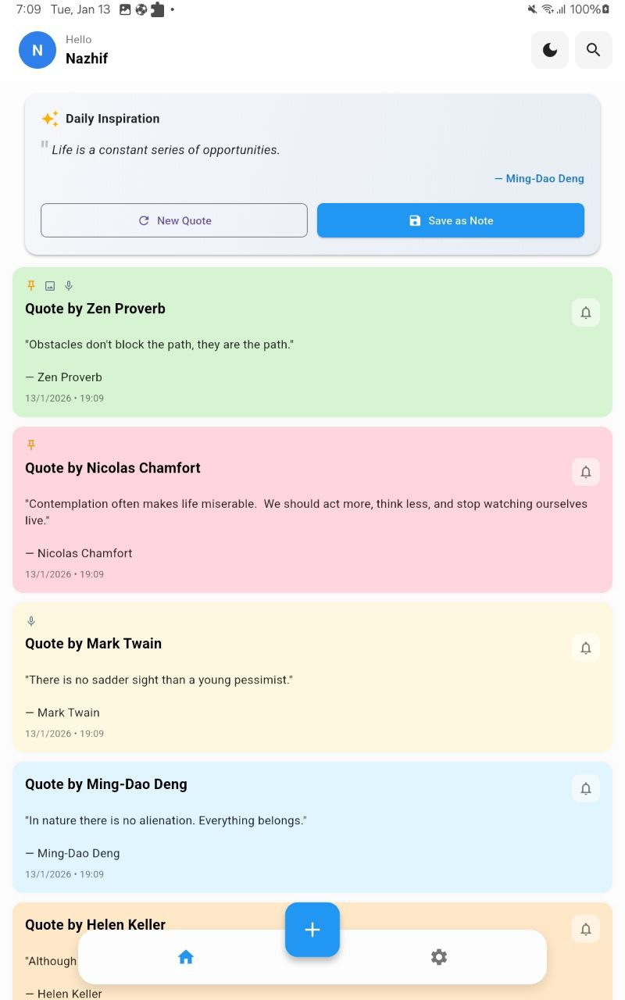
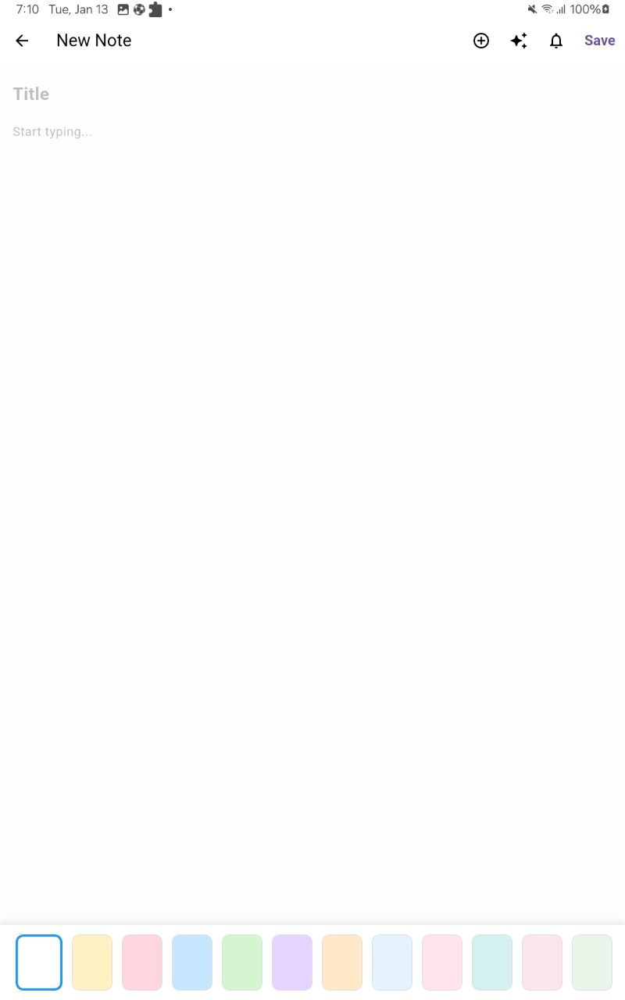
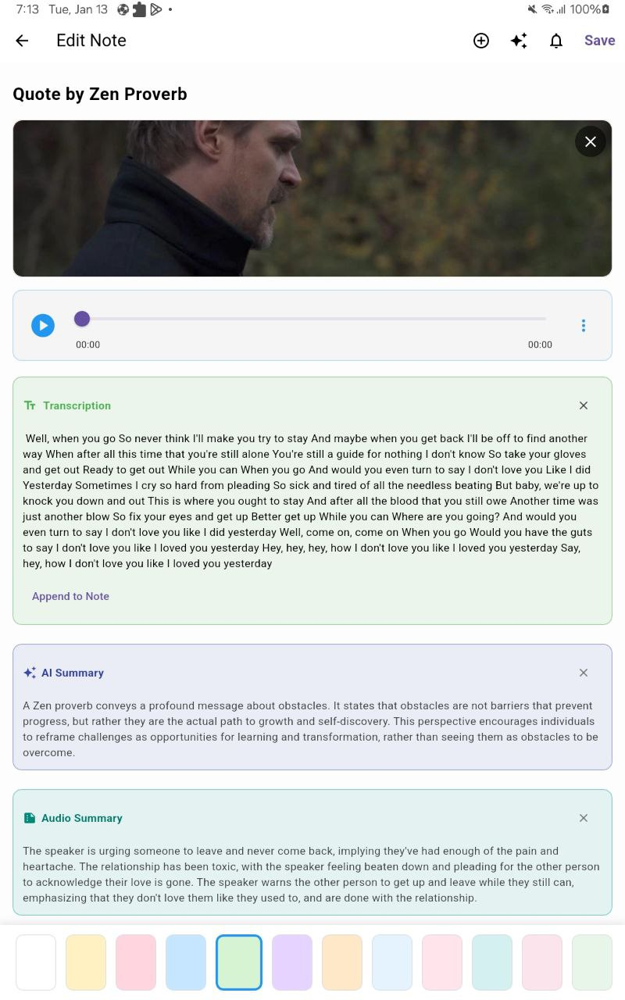

# MyNotes 📝

MyNotes is a powerful, AI-enhanced note-taking application built with Flutter. It combines a beautiful pastel UI with robust cloud synchronization and smart features to help you capture and organize your thoughts effortlessly.

## ✨ Features

- **AI-Powered Insights**: Automatically generate summaries for your notes and audio transcriptions using Groq and Cerebras AI integration.
- **Smart Transcriptions**: Record audio notes and get accurate text transcriptions instantly.
- **Cloud Sync**: Seamlessly sync notes across devices using Firebase Cloud Firestore.
- **Offline First**: Work offline with full functionality; data syncs automatically when you're back online (powered by Hive).
- **Beautiful UI**: Enjoy a soothing pastel color palette, smooth animations, and a clutter-free interface.
- **Reminders**: Set smart reminders for your tasks and never miss a deadline.
- **Secure**: Privacy-focused design with secure authentication and safe data storage.

## 🚀 Getting Started

### Prerequisites

- Flutter SDK (Latest Stable)
- Firebase Project Setup
- API Keys for AI Services (Groq / Gemini)

### Installation

1. **Clone the repository**
   ```bash
   git clone https://github.com/yourusername/mynotes.git
   cd mynotes
   ```

2. **Install dependencies**
   ```bash
   flutter pub get
   ```

3. **Configure Environment**
   Duplicate `.env.example` to `.env` and add your API keys:
   ```bash
   cp .env.example .env
   ```
   *Edit `.env` with your actual keys.*

4. **Run the App**
   ```bash
   flutter run
   ```

## 🛠️ Tech Stack

- **Framework**: Flutter
- **State Management**: Riverpod
- **Local Database**: Hive
- **Cloud Backend**: Firebase (Auth, Firestore)
- **AI Integration**: Groq API, Cerebras API

## 📸 Screenshots

| Home Screen | Note Editor | AI Summary |
|:-----------:|:-----------:|:----------:|
|  |  |  |

*(Note: Add your actual screenshots in `docs/screenshots/`)*

## 📄 License

This project is licensed under the MIT License - see the [LICENSE](LICENSE) file for details.
